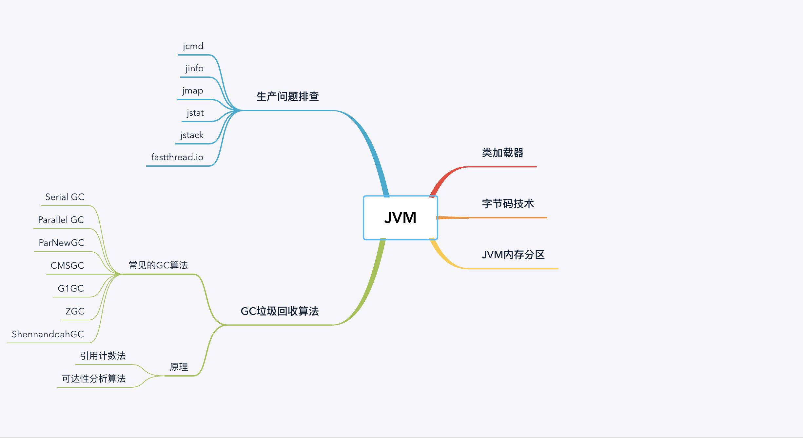
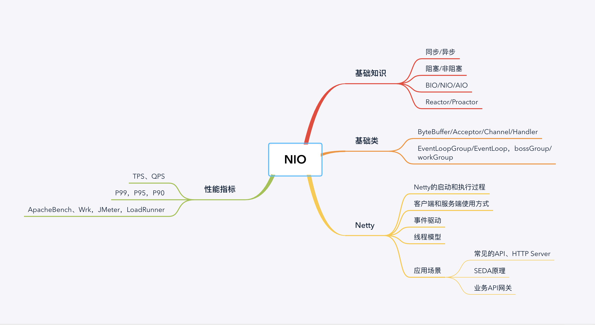
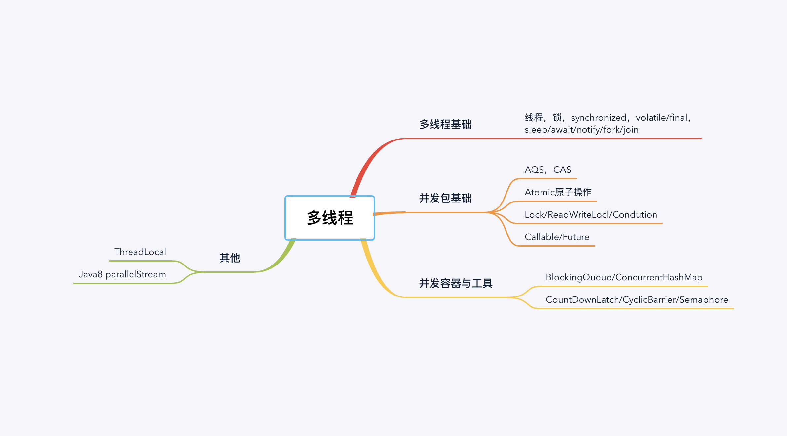
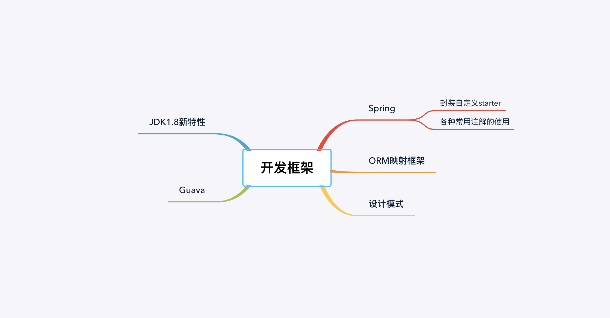
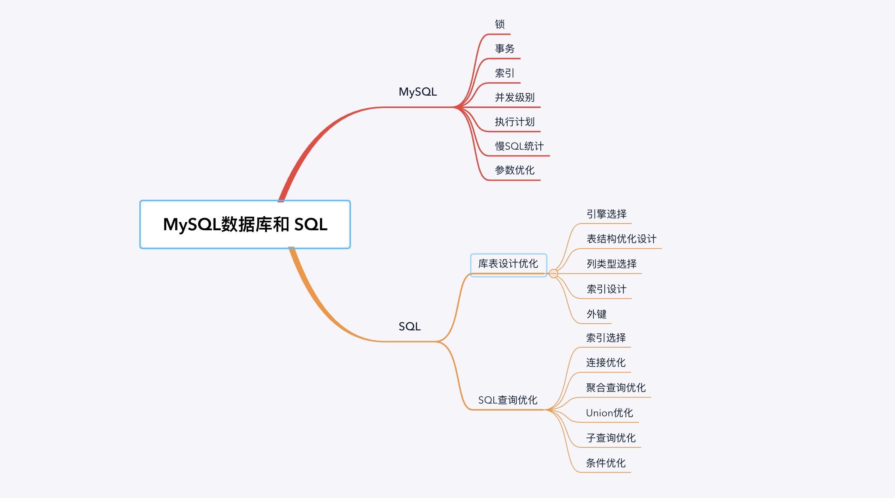
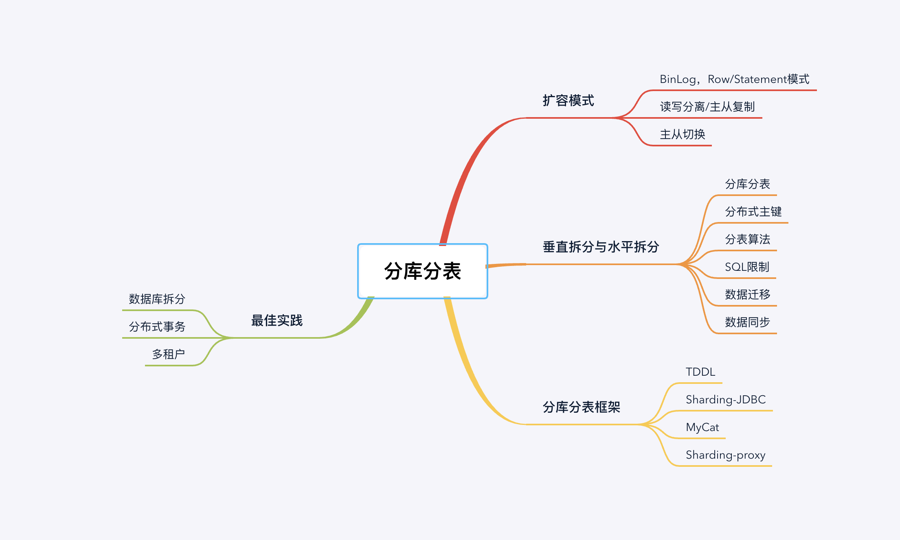
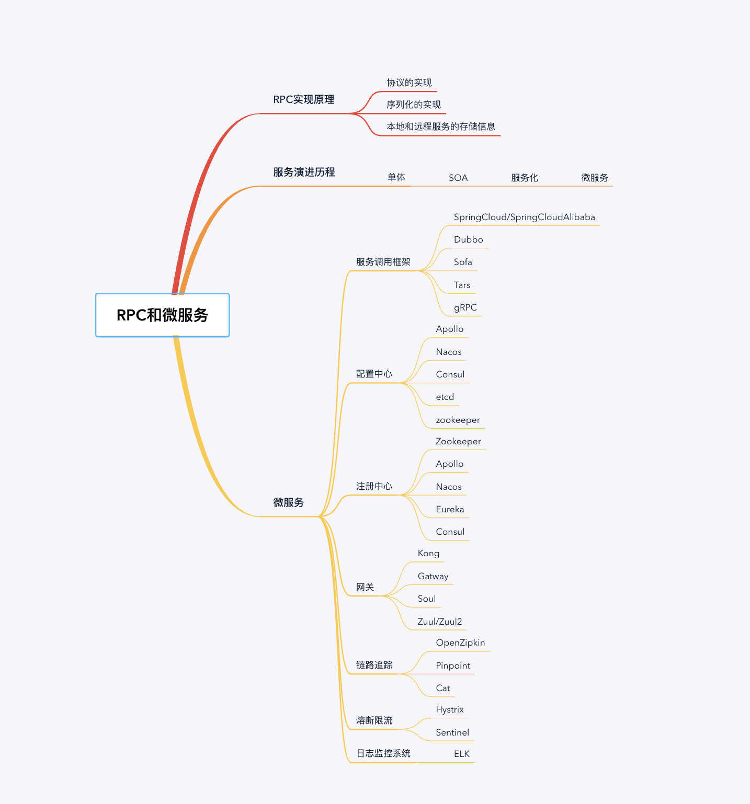
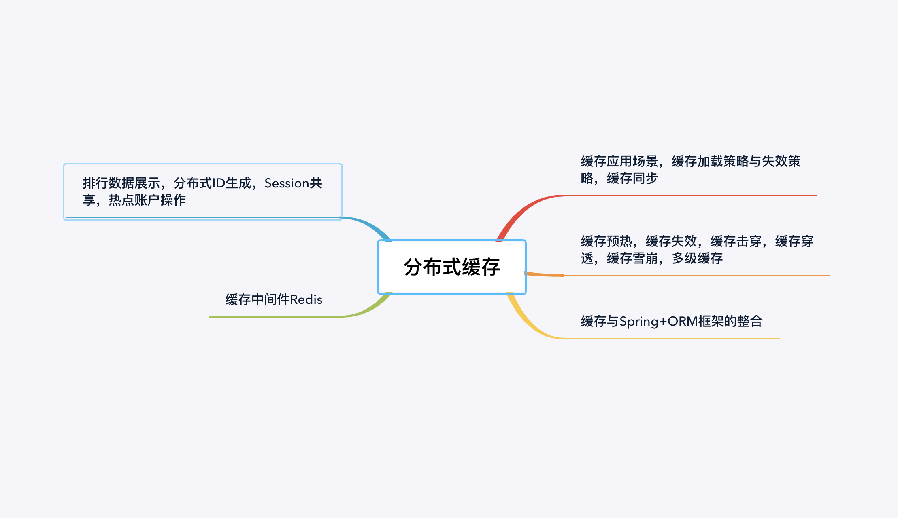
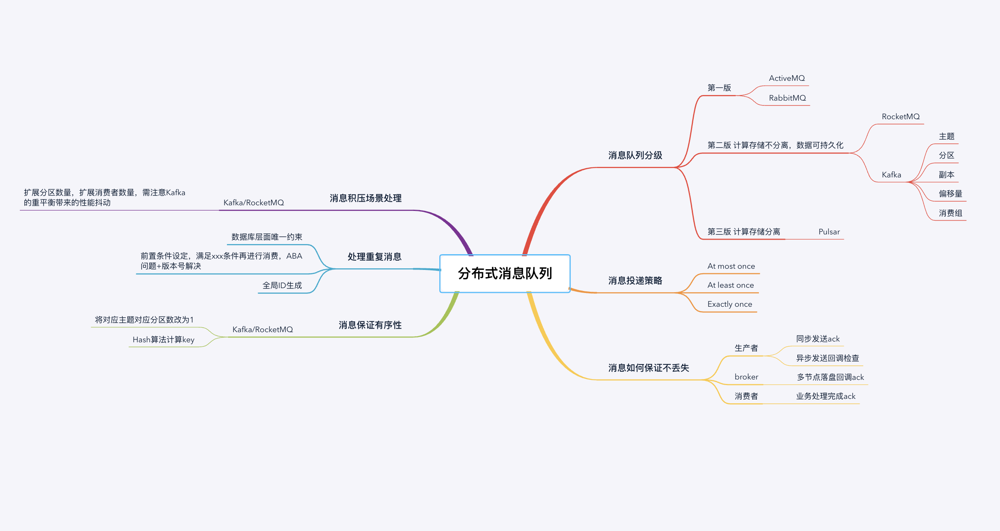

首先，认识老师、班班、教研团队、助教团队的确是我个人职业生涯的幸运，虽然课程对我个人而言后续还需要很长的时间去消化吸收，但是这段经历是感动的、难忘的。除了秦老师外，还特别要实名表白爽爽、崔崔、嘉嘉、猫大人、富飞哥，以及近卫军团和梦码的所有小伙伴们，Java0期，永不过期！

模块一：JVM 

JVM 基础知识、Java 字节码技术、JVM 类加载器、JVM 内存模型、JVM 启动参数详解；

JDK 内置命令行工具、JDK 内置图形界面工具、JDWP 简介、JMX 与相关工具；

常见的 JVM GC 算法（Parallel GC/CMS GC/G1 GC）基本原理和特点；

新一代 GC 算法（Java11 ZGC/Java12 Shenandoah）和Oracle Graalvm；

GC 日志解读与分析、JVM 的线程堆栈等数据分析、内存 dump 和内存分析工具u；

fastThread 相关工具以及面临复杂问题时的几个高级工具的使用；

JVM 问题排查分析的常用手段、性能调优的最佳实践经验等；

JVM 相关的常见面试问题必知必会、全面分析。

模块二：NIO 

同步/异步、阻塞/非阻塞、BIO、NIO、AIO、Reactor/Proactor；

ByteBuff/Acceptor/Channel/Handler、NioEventLoopGroup/EventLoop、bossGroup/workerGroup；

Netty 的启动和执行过程、线程模型、事件驱动、服务端和客户端的使用方式；

常见的 API Gateway/HTTP Server、SEDA 原理、业务 API 网关的功能和结构；

Throughout/TPS/QPS、Latency/P99/P95/P90、ApacheBench/Wrk/JMeter/LoadRunner。

模块三：并发编程

Java 多线程基础：线程、锁、synchronized、volatile/final、sleep/await/notify/fork/join；

Java 并发包基础：线程池 Executor、AQS/CAS、Atomic 原子操作、Lock/ReadWriteLock/Condition、Callable/Future；

Java 并发容器与工具：BlockingQueue/CopyOnWriteList/ConcurrentHashMap、CountDownLatch/CyclicBarrier/Semaphore等；

模块四：Spring和ORM框架

Spring 技术体系（Spring Core/Web/MVC/Data/Messaging、Spring Boot 等）；

ORM 技术体系（JPA、Hibernate、MyBatis 等）。

模块五：MySQL 数据库和 SQL

系统可观测性（日志、调用链跟踪、指标度量），80/20 优化原则，CPU、内存、磁盘/网络 IO 等分析；

MySQL 的锁、事务、索引、并发级别、死锁、执行计划、慢 SQL 统计、缓存失效、参数优化；

库表设计优化，引擎选择，表结构优化设计，列类型选择，索引设计，外键等；

SQL 查询优化，索引选择，连接优化，聚合查询优化，Union 优化，子查询优化，条件优化等；

场景分析，主键生成与优化，高效分页，快速导入导出数据，解决死锁问题等。

模块六：分库分表

MySQL 主从复制，Binlog，Row/Statement 模式，主从切换，读写分离，数据库扩容；

数据库垂直拆分与水平拆分，分库分表，分布式主键，分表算法，SQL 限制，数据迁移，实时同步；

Spring 动态切换数据库，TDDL/Sharding-JDBC 框架，MyCat/Sharding-Proxy 中间件；

数据库拆分的最佳实践，分布式事务的最佳实践，多租户的最佳实践。

模块七：RPC和微服务

基础知识：RPC、通信与数据协议、WebService、Hessian、REST、gRPC、Protocol Buffers 等；

服务化：服务治理、配置管理、注册发现、服务分组、版本管理、集群管理、负载均衡、限流与降级熔断等；

框架：Apache Dubbo 的功能与原理分析，Spring Cloud 体系，具体的案例实践；

微服务：微服务架构的 6 个最佳实践，从微服务到服务网格、云原生的介绍。

模块八：分布式缓存

缓存的应用场景，缓存加载策略与失效策略，缓存与数据库同步等；

缓存预热、缓存失效、缓存击穿、缓存雪崩、多级缓存、缓存与 Spring+ORM 框架集成；

缓存中间件，Redis（几种常用数据结构、分布式锁、Lua 支持、集群），Hazelcast（Java 数据结构、内存网格、事务支持、集群）；

缓存的应用场景，排行数据展示，分布式 ID 生成，Session 共享，热点账户操作等。

模块九：分布式消息队列

消息队列的基本知识，Broker 与 Client，消息模式（点对点、发布订阅），消息协议（STOMP、JMS、AMQP、OpenMessaging 等），消息 QoS（最多一次、最少一次、有且仅有一次），消息重试，延迟投递，事务性，消息幂等与去重；消息中间件：

ActiveMQ 的简单入门，Kafka 的基本功能与使用，高可用（集群、分区、副本）、性能，RabbitMQ 和 RocketMQ，Pulsar 的简单介绍；

消息的 4 个主要功能，搭建一个 Kafka 集群，实现常用的消息发送、消息消费功能；典型使用场景，使用 MQ 实现交易订单的处理，动手实现一个简化版的消息队列。

